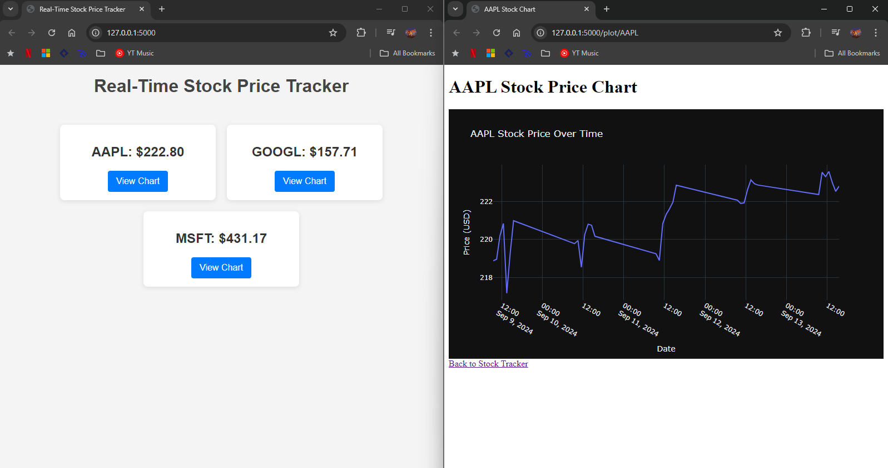

# Real-Time Stock Price Tracker

A real-time stock price tracker web application that displays live sample stock prices and generates interactive charts to visualize stock price trends over time. 

## Features

- **Real-Time Stock Price Updates**: Track live stock prices and updates using WebSockets.
- **Stock Trend Visualization**: Generate interactive charts using Plotly to visualize price changes over time.
- **Multiple Stock Tracking**: Add multiple stocks to track and compare them on the same chart.
- **Responsive UI**: The interface is designed to work smoothly across all device sizes.

## Technologies Used

- **Flask**: A lightweight Python web framework for handling backend logic.
- **Socket.IO**: For real-time communication between the server and client, allowing live stock price updates.
- **Plotly**: For generating dynamic and interactive charts to display stock price trends.
- **Yahoo Finance API (`yfinance`)**: Fetching live stock prices and historical data.
- **HTML/CSS/JavaScript**: Used to structure, style, and add interactivity to the front end.
- **SQLite**: Can be used to store stock data locally.

## Skills Demonstrated

1. **Flask**:
   - Creating routes for different views (home, charts).
   - Handling real-time data via WebSockets.
   
2. **WebSockets**:
   - Implementing real-time communication using Flask-SocketIO.
   - Broadcasting live updates of stock prices to clients.

3. **Data Visualization**:
   - Using Plotly to create real-time, interactive stock price charts.
   - Customizing chart design, layout, and interactive features.

4. **API Integration**:
   - Using the `yfinance` library to fetch real-time and historical stock data.
   - Handling API requests and processing data for visualization.

5. **Frontend Development**:
   - Using HTML, CSS, and JavaScript to create a responsive and dynamic user interface.
   - Utilizing jQuery for dynamic updates of stock prices in the frontend."# Real-Time-Stock-Price-Tracker" 
